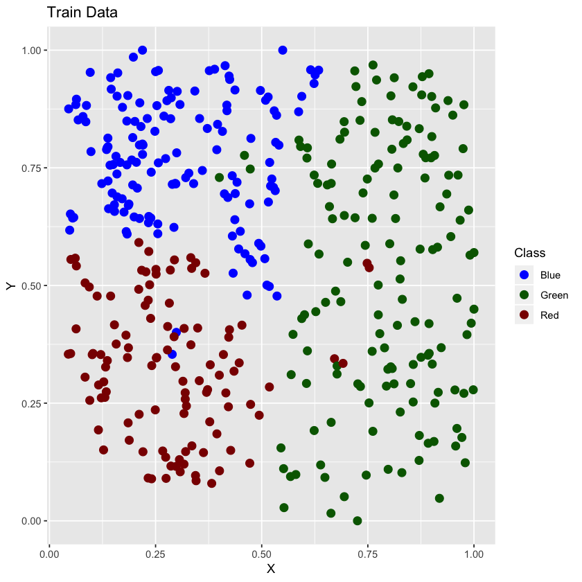
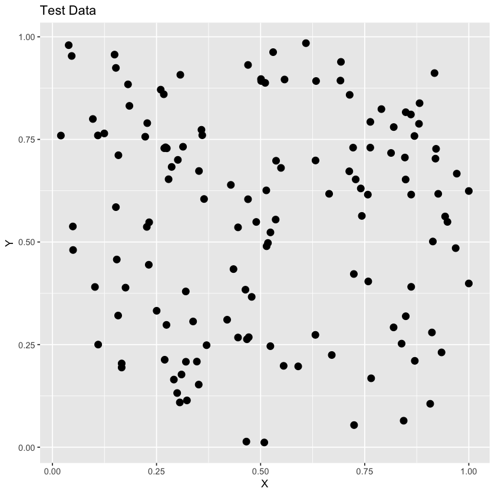

# Introduction
The idea of this notebook is to explore a step-by-step approach to create a <b>K-Nearest Neighbors Algorithm</b> without the help of any third party library. In practice, this Algorithm should be useful enough for us to classify our data whenever we have already made clusters (in this case color) which will serve as a starting point to find neighbors.

## 1. Working Data

```R
# Data to learn
library(readr)
RGB <- as.data.frame(read_csv("RGB.csv"))
RGB$x <- as.numeric(RGB$x)
RGB$y <- as.numeric(RGB$y)
print("Working data ready")
```

### 1.1 Train and test sample generation

We will create 2 different sample sets:

- <b>Training Set:</b> This will contain 75% of our working data, selected randomly. This set will be used to train our model.
- <b>Test Set:</b> Remaining 25% of our working data, which will be used to test the accuracy of our model. In other words, once our predictions of this 25% are made, will check the "<i>percentage of correct classifications</i>" by comparing predictions versus real values.

```R
# Training Dataset
smp_siz = floor(0.75*nrow(RGB))
train_ind = sample(seq_len(nrow(RGB)),size = smp_siz)
train =RGB[train_ind,]

# Test Dataset
test=RGB[-train_ind,]
OriginalTest <- test
paste("Training and test sets done")
```

### 1.2 Train Data

We can observe that our train data is classified in 3 clusters based on colors.

```R
# We plot test colored datapoints
library(ggplot2)
colsdot <- c("Blue" = "blue", "Red" = "darkred", "Green" = "darkgreen")
ggplot() + 
  geom_tile(data=train,mapping=aes(x, y), alpha=0) +
  ##Ad tiles according to probabilities
  ##add points
  geom_point(data=train,mapping=aes(x,y, colour=Class),size=3 ) + 
  scale_color_manual(values=colsdot) +
  #add the labels to the plots
  xlab('X') + ylab('Y') + ggtitle('Train Data')+
  #remove grey border from the tile
  scale_x_continuous(expand=c(0,.05))+scale_y_continuous(expand=c(0,.05))
  ```


### 1.2 Test Data
Even though we actually know the color classification of our test data, we will try to create a model that's able to guess it's true color. For this, we will save our tests colors and compare them with our predictions to calculate our <b>Model Accuracy</b>.

```R
# We plot test colored datapoints
colsdot <- c("Blue" = "blue", "Red" = "darkred", "Green" = "darkgreen")
ggplot() + 
  geom_tile(data=test,mapping=aes(x, y), alpha=0) +
  ##Ad tiles according to probabilities
  ##add points
  geom_point(data=test,mapping=aes(x,y),size=3 ) + 
  scale_color_manual(values=colsdot) +
  #add the labels to the plots
  xlab('X') + ylab('Y') + ggtitle('Test Data')+
  #remove grey border from the tile
  scale_x_continuous(expand=c(0,.05))+scale_y_continuous(expand=c(0,.05))
```



Note: we have purposely forgot it's classification colors in order to create a model that's able to guess it

## 2. K-Nearest Neighbors Algorithm

Below is a step-by-step example of an implementation of this algorithm.
What we want to achieve is for each selected gray point above (our test values), where we allegedly don't know it's true color, find the nearest neighbor or nearest colored paint (from our train values) and assign the same color as this one.

<b>In particular, we need to:</b>
- <b>Normalize data:</b> even though in this case is not really needed, since all values are in the same scale (decimals between 0 and 1), it's recommended to normalize in order to have a "standard distance metric".
- <b>Define how we measure distance:</b> We can define the distance between two points in this 2 dimensional data set as the Euclidean distance between them. We will calculate both L1 (sum of absolute differences) and L2 (sum of squared differences) distances, though final results will be calculated using L2 since it's more unforgiving than L1.
- <b>Calculate Distances:</b> we need to calculate distance between each tested data point and every value within our train dataset. Normalization is key here since for example, in the case of body structure, a distance in weight (1 KG) and height (1 M) is not comparable. For such case we can anticipate a higher deviation in KG than it is on the Meters, leading to incorrect overall distances.
- <b>Sort Distances:</b> Once we calculate the distance between every test and training points, we need to sort them in descending order.
- <b>Selecting top K nearest neighbors:</b> We select the top K nearest points and in order to inspect which category (colors) they belonged in order to assign this category to our tested point. Since we select multiple "neighbors" we might end up with multiple categories, in which case, we can calculate a probability.


